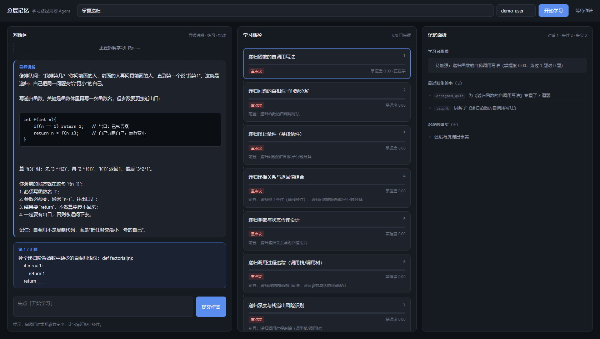

# 分层记忆驱动的学习路径规划 Agent 设计与实现

本科毕业论文项目。构建一个具备**分层记忆**与**动态任务规划**能力的个性化学习伴侣 Agent 系统。

## 界面



左栏是对话区（导师讲解逐字流式输出、出题、批改），中栏是学习路径（每步带掌握度与依赖关系），
右栏是记忆面板（学习者画像、情景事件、沉淀事实）。三个栏位的数据全部来自同一套分层记忆。

## 核心研究点

| 章节 | 内容 | 关键技术 |
| --- | --- | --- |
| 第 4 章 | 分层记忆机制 | 工作记忆 / 情景记忆 / 语义记忆，SQLite 持久化 |
| 第 5 章 | 动态任务规划 | LangGraph 多 Agent 编排（导师 / 出题 / 评估 / 规划） |
| 第 6 章 | 知识检索与验证 | RAG 四件套 + 向量库 + 前端 + 3 组对比实验 |

## 技术栈

- **语言**：Python
- **Agent 框架**：LangGraph（状态图 + 条件路由 + 循环 + checkpointer）、LangChain
- **RAG**：文本切分 → 向量化 → Chroma 检索 → 重排
- **后端**：FastAPI + SSE 流式输出
- **前端**：原生 HTML / CSS / JS（无构建步骤，直接由后端托管）
- **持久化**：SQLite（分层记忆与学习者画像）
- **模型接入**：DeepSeek API
- **工程化**：Docker 容器化、MCP 协议

## 目录规划

```
.
├── src/              # 核心源码
│   ├── memory/       # 分层记忆三件套 + 遗忘策略 + 上下文组装
│   ├── planning/     # 学习者画像、目标拆解、路径规划、LangGraph 编排
│   ├── agents/       # 导师 / 出题 / 评估三类功能 Agent
│   ├── rag/          # 检索增强生成（加载 / 切分 / 向量库 / 检索）
│   └── api/          # FastAPI 服务层（应用工厂 + 路由 + 会话缓存 + SSE）
├── web/              # 前端页面（静态资源，由后端托管）
├── tests/            # 单元测试与边界测试
├── examples/         # 可运行示例
├── scripts/          # 知识库构建、进度看板、一键校验
├── docs/             # 设计文档、实验记录、界面截图
├── data/             # 数据文件（不入库）
├── .env.example      # 环境变量模板
└── README.md
```

## 快速开始

```bash
# 1. 创建并激活虚拟环境
python -m venv .venv
.venv\Scripts\activate        # Windows PowerShell

# 2. 安装依赖
pip install -r requirements.txt

# 3. 配置密钥（注意：要填在 .env 里，不是 .env.example）
copy .env.example .env

# 4a. 只想看效果：跑学习闭环 demo（命令行）
python examples/demo_learning.py

# 4b. 想用界面：起服务，然后打开 http://127.0.0.1:8000
python -m uvicorn src.api.app:app --reload
```

打开 http://127.0.0.1:8000/docs 可以看到自动生成的接口文档，
每个字段的含义都在上面。

## 环境变量


| 变量名 | 说明 |
| --- | --- |
| `DEEPSEEK_API_KEY` | DeepSeek 平台密钥（**必填**） |
| `DEEPSEEK_BASE_URL` | 接口地址，默认 `https://api.deepseek.com` |
| `MEMORY_DB_PATH` | 分层记忆 SQLite 文件位置 |
| `CHROMA_PERSIST_DIR` | 向量库持久化目录 |
| `API_HOST` / `API_PORT` | FastAPI 监听地址与端口 |
| `LOG_DIR` | 日志文件目录 |

> `.env` 已在 `.gitignore` 中排除，请勿将真实密钥提交到仓库。

## 开发约定

- 提交信息格式：`<类型>: <简述>`，类型取 `feat` / `fix` / `docs` / `refactor` / `test` / `chore`
- 分支策略：`main` 保持可用，功能开发走 `feat/xxx` 分支
- 每完成一个功能模块提交一次，保持提交粒度清晰

## 作者

肖宇轩 · 广州商学院 · 计算机科学与技术（2023–2027）
